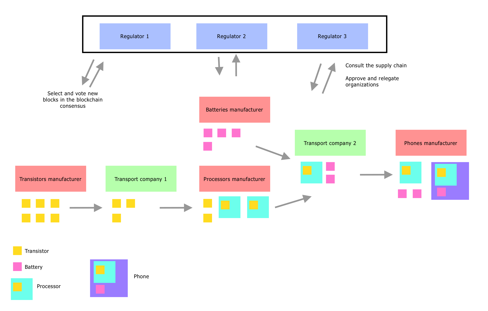

# Supply Chain X

Supply Chain X is a PoA powered Cosmos SDK blockchain application to manage and track manufactured products in a supply chain.

The interest of this application is to record the information about products in an immutable way. Provided queries allow the user to find interesting information like what are the components of a specific product, where the product comes from, or where the components of the product come from.

## Actors

There are two actors:
- Organizations
- Authorities

Organizations represent organizations that manufacture and/or transfer product in the supply chain.

An authority is a regulator of the supply chain. They can append new organizations in the systems. They can also relegate and reapprove organizations. When an organization is relegated. It can't interact with the supply chain anymore.

Authorities are the stakeholders that support the PoA consensus engine of the blockchain. They are validators in the PoA module. More information about the PoA module can be found here: [PoA module](https://github.com/ltacker/poa)

## Products

Once approved, an organization can manufacture and transfer units in the supply chain.

A unit is a manufactured unit of a product. A unit can be composed of other units held by the manufacturer and can be transferred to other organizations.
Once the unit is used to compose another unit, it cannot be transferred anymore.

All information and actions performed to a unit are immutably recorded in the blockchain and can be requested through queries.

## Overview

This is an example with 6 organizations and 3 authorities:

## Queries

The following queries are available to consult the supply chain and get information about product:

- `organizations`   Get the list of all organizations
- `organization`    Describe an organization
- `product`         Describe a product
- `product-units`   Get the list of all units of the product
- `unit`            Describe a unit
- `unit-trace`      Get all the organizations the unit passed through
- `unit-components` Get all the product units composing a unit

They can be called with the command `scxcli query scx <query>`

## Transactions

The following transactions are available to interact with the supply chain

- `append-organization`    Append a new organization to interact with the ledger
- `relegate-organization`  Relegate an organization to prevent it to interact with the ledger
- `reapprove-organization` Reapprove a relegated organization
- `create-product`         Create a new product
- `create-unit`            Create a new unit of a product
- `transfer-unit`          Transer a unit to a new organization

They can be called with the command `scxcli tx scx <tx>`

## Technical specifications

The state of the supply chain is managed by the `scx` module. The specifications of this module can be found [here](./x/scx/spec/README.md)

## Demonstration Example

An example of the interaction with the application can be found [here](./DEMO.md)
